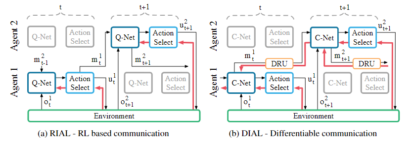
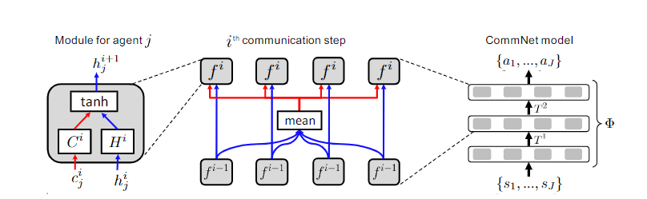

# MADRL-readings

### Multi-agent actor-critic for mixed cooperative-competitive environments. (Lowe et al., 2017)

### Counterfactual multi-agent policy gradients. (Foerster et al., 2018)

### Deep decentralized multi-task multi-agent rl under partial observability. (Omidshafiei et al., 2017)

### Cooperative multi-agent control using deep reinforcement learning. (Gupta et al., 2017)

### Fully decentralized multiagent reinforcement learning with networked agents. (Zhang et al. 2018) 

### Stabilising experience replay for deep multi-agent reinforcement learning. (Foerster et al. 2017)

### Mean field multi-agent reinforcement learning. (Yang et al., 2018).

---
## Learning to communicate with deep multi-agent reinforcement learning.(Foerster et al., 2016).

Goal: 
- learn a discrete communication signal among agents in a fully cooperative, partially observable settings.

Description:
- at each timestep t, each agent receives a local observation **ot** and discrete message signals from other agents **mt-1**
- then, it should take an environment action **ut** and a communication action **mt** 
- the communication action is sent to other agents via a communication channel. 

Method: 
- Reinforced Inter-Agent Learning (RIAL):  
  - agents use two deep Q networks **Qau(oat, ma't-1, hat-1, ua)** and **Qm(.)** to predict Q-values for environment and communication actions respectively, where:
    - **oat** is the agent's local observation, 
    - **ma't-1** are messages from other agents,
    - **hat-1** is the agent's hidden state (RNN to overcome partial observability)
  - the Q values are then passed to an action selector unit to pick **uat** and **mat** (using an ε-greedy policy).
  - it's end-to-end trainable within an agent (no gradients are passed between agents)
  - gradient chains are based on the DQN loss

- Differentiable Inter-Agent Learning (DIAL):
  - communication actions are replaced with direction connections from the output of one agent's network to the input of another
  - gradients can be pushed through the communication channel, yielding a system that is end-to-end trainable even across agents
  - gradient chains are based on both the DQN loss and the backpropagated error from the recipient of the message to the sender

They followed a centralized training decentralized execution paradigm. 

Centralized training is achieved via:
- parameter sharing (learning a single network) in RIAL.
- parameter sharing and pushing gradients across agents through the communication channel in DIAL.

---

### Learning multiagent communication with backpropagation. (Sukhbaatar et al., 2016).

Goal:
- coordination between agents in fully cooperative, partially observable settings by learning suitable communication between them

Description: 
- learns a single controller **Φ** that maps agents' states **s = {s1, ..., sJ}** into their actions **a = {a1, ..., aJ}** where **J** is the number of agents
- **Φ** consists of individual modules **fi** where i refers to the communication step
- each module **f** takes two input vectors for each agent **j**: the hidden state **hij** and the communication **cij** and outputs a vector **hi+1j**
- the output vectors **hi+1** are then averaged according to the following formula to compute the communication for the next step **ci+1j**

---

### Multiagent bidirectionally-coordinated nets: Emergence of human-level coordination in learning to play starcraft combat games. (Peng et al., 2017)

### Revisiting the master-slave architecture in multi-agent deep reinforcement learning. (Kong et al., 2017),

### Learning attentional communication for multi-agent cooperation. (Jiang & Lu, 2018)

### Learning when to communicate at scale in multiagent cooperative and competitive tasks. (Singh et al., 2018)

