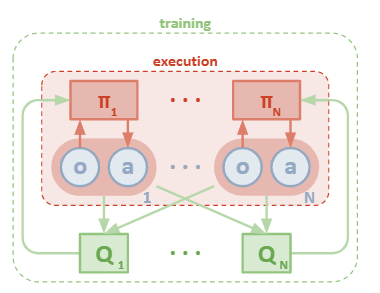
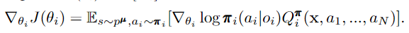
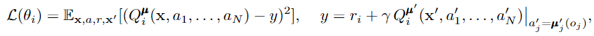
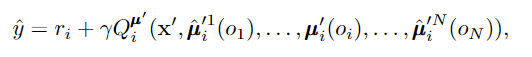
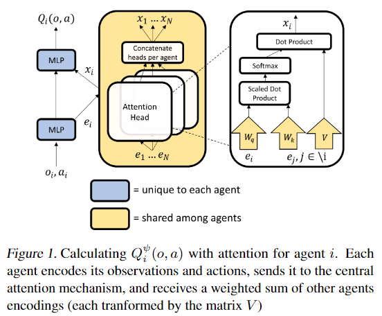
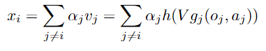
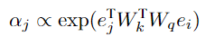
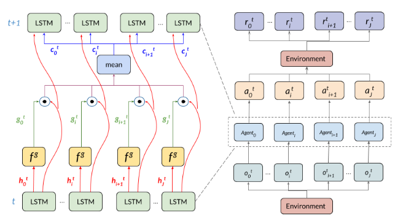
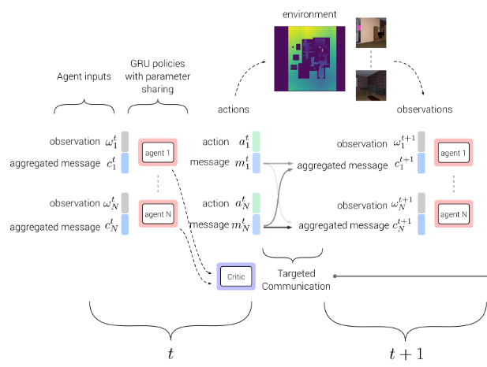
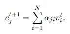

# MADRL-readings

## Centralized Training Decentralized Execution

#### Cooperative multi-agent control using deep reinforcement learning. (Gupta et al., 2017) 

- extends single deep learning algorithm into multi-agent settings and evaluate them
- centralizing training -> parameter sharing

#### Counterfactual multi-agent policy gradients. (Foerster et al., 2018) - COMA

- centralized critic conditions on the joint action-observation histories 
- learns a single centralized critic for all agents
- only cooperative settings

#### Multi-agent actor-critic for mixed cooperative-competitive environments. (Lowe et al., 2017)

- extends COMA to competitve and mixed settings by learning a centralized critic for each agent

#### Actor-Attention-Critic for Multi-Agent Reinforcement Learning (Iqbal et al., 2019)

- support the centralized critic with attention mechanism to dynamically select which agents to attend to 

---

## Value Decomposition (value-based)

#### Value-Decomposition Networks For Cooperative Multi-Agent Learning (Sunehag et al., 2017) - VDN

- assumption is that joint action-value function for the system can be additively decomposed into value functions across agents
- represents Q_tot as a sum of individual value functions Q_a that conditions only on individual observations and actions 

#### QMIX: Monotonic Value Function Factorisation for Deep Multi-Agent Reinforcement Learning (Rashidet al., 2018)

- generalize VDN
- only need to ensure that a global argmax performed on Q_tot yields the same result as a set of individual argmax operations performed on each Q_a (monotonic)

#### Randomized Entity-wise Factorization for Multi-Agent Reinforcement Learning (Iqbal al., 2021)

---

## Learn Communication 

#### Learning to communicate with deep multi-agent reinforcement learning.(Foerster et al., 2016). - RIAL & DIAL

- learn communication signal among agents in a fully cooperative, partially observable settings.

#### Learning multiagent communication with backpropagation. (Sukhbaatar et al., 2016). - CommNet

#### Learning when to communicate at scale in multiagent cooperative and competitive tasks. (Singh et al., 2018)

- learn what to communicate and when to communicate (allow agents to block their communication using a gating mechanism)

#### Learning attentional communication for multi-agent cooperation. (Jiang & Lu, 2018) - ATOC

- enables **dynamic** communication among agents only when necessary
- when communication is needed, a communication group is formed by selecting at most m (fixed bandwidth) agents from agent's observable field based on proximity
- then, the agents within that communication group are allowed to share information for number of timesteps

#### TarMAC: Targeted Multi-Agent Communication (Das et al., 2020)

- not only learn what to send, but also to whom to address
- uses a signature-based soft attention mechanism to allow agents choose which agents to address messages to 

# ** Cooperative multi-agent control using deep reinforcement learning. (Gupta et al., 2017)

They focus on problems that can be modeled as Dec-POMDPs

They extend three classes of single-agent deep reinforcement learning algorithms:
- temporal-difference learning using Deep Q Networks (DQN)
- policy gradient using Trust Region Policy Optimization (TRPO)
- actor-critic using Deep Deterministic Policy Gradients (DDPG) 
- actor-critic using Asynchronous Advantage Actor Critic (AC3) 

They consider three training schemes 
- centralized training and execution
  - maps the joint observation of all agents to a joint action
  - issues: exponential growth in the observation and actions spaces with the number of agents 
  - to address the exponential growht action space, they factor the joint action into individual components for each agent, which reduces the size of the action space from |A|n to n|A| in the discrete case

- concurrent training with decentralized execution
  - each agent learns its own individual policy
  -  map an agent’s private observation to an action for that agent
  -  issues: non-stationary, which can lead to instability + adds additional sample complexity to the problem because agents don't share experience 

- parameter sharing during training with decentralized execution
  - allows the policy to be trained with the experiences of all agents simultaneously
  - control is decentralized but the learning is not

Results:
- policies trained with parameter sharing and an appropriate choice of reward function exhibit cooperative behavior without explicit communication between agents
- PS-TRPO policies have substantially better performance than PS-DDPG and PS-A3C in continuous action space
- PS-A3C is able to outperform PS-TRPO in the discrete domain
- curriculum learning is vital to scaling reinforcement learning algorithms in complex multi-agent domains (gradually increasing the number of agentsthat need to cooperate)

---

# Counterfactual multi-agent policy gradients. (Foerster et al., 2018) - COMA

COMA 
- centralisation of the critic
  - the critic is only used during learning, while only the actor is needed during execution
  - the critic conditions on the true global state s, if available, or the joint action-observation histories, while each agent’s policy/actor conditions only on each agent's own action-observation history

- use of a counterfactual base-line
  - naive approach: follow a gradient based on the TD error estimated from this critic (gradient for a particular agent does not explicitly reason about how that particular agent’s ac-tions contribute to that global reward)

  - instead, it uses a counterfactual baseline (inspired by difference rewards which compares the global reward to the reward received when that agent’s action is replaced with a default action)
  - the centralised critic can be used to implement difference rewards (without any further simulations or complications)
  - For each agent a, we can compute an agent-specific advantage function that compares the Q-value for the current joint action u to a counterfactual baseline that marginalises out a single agent’s action ua, while keeping the other agents’ actions u-a fixed

  
  - thus, it computes a separate baseline for each agent that relies on the centralised critic to reason about counterfactuals in which only that agent’s action changes

- use of a critic representation that allows efficient evaluation of the baseline
  - the actions of the other agents, ut−a, are part of the input to the critic network, which then outputs a Q-value for each of agent a’s actions. In other words, the critic computes in a single forward the Q-values for all the different actions of a given agent, conditioned on the actions of all the other agents
  - counterfactual advantage can be calculated efficiently by a single forward pass of the actor and critic for each agent

They also introduced 2 variatns of independent actor-critic (IAC)
- each agent learn independently, with its own actor and critic conditions only on its own action-observation history
- speed learning by sharing parameters among the agents
- the critic in the 1st variant estimates V while it estimates Q in the 2nd variant

COMA can significantly improve performance over other multi-agent actor-critic methods

COMA’s best agents are competitive with state-of-the-art centralised controllers that are given access to full state information and macro-actions

---
# *** Multi-agent actor-critic for mixed cooperative-competitive environments. (Lowe et al., 2017)

adopt the framework of centralized training with decentralized execution

a general-purpose multi-agent learning algorithm, which can be applied not only to cooperative interaction but to competitive or mixed interaction involving both physical and communicative behavior

a simple extension of actor-critic policy gradient methods where the critic is augmented with extra information about the policies of other agents, while the actor only has access to local information. 

only the local actors are used at execution phase, acting in a decentralized manner

The gradient of the expected return for agent i can be written as 

where Qπi(x,a1,...,aN) is a centralized action-value function. in the simplest case, x consists of the observations of all agents, but it could also include additional state information

the centralized action-value function Qπi is updated using

To remove the assumption of knowing other agents’ policies, each agent can maintain an approximation to the true policy of each other agent and use them in their own policy learning procedure. 

One downside is that the input space of Q grows linearly with the number of agents N. This could be remedied by, for example, having a modular Q function that only considers agents in a certain neighborhood of agiven a gent

vs COMA:
- learn a centralized critic for each agent (allowing differing reward functions) whereas COMA learns a single centralized critic for all agents 
- learn continuous policies whereas COMA learns discrete policies 

--- 

# Actor-Attention-Critic for Multi-Agent Reinforcement Learning (Iqbal et al., 2019)

an actor-critic algorithm that trains decentralized policies in multi-agent settings, using centrally computed critics that share an attention mechanism which selects relevant information for each agent at every timestep.

The main idea is to learn a centralized critic with an attention mechanism. The attention critic is able to dynamically select which agents to attend to at each time point during training, which improves performance in multi-agent domains with complex interactions.

The attention mechanism functions in a manner similar to a differentiable key-value memory model. Each agent queries the other agents for information about their observationsand actions and incorporates that information into the esti-mate of its value function. 

The critic Qψi(o,a) is a function f of agent i’s observation o and action a, as well as other agents’ contributions x

where gi is a one-layer embedding function.

The contribution from other agents, xi, is a weighted sum of each agent’s value, where the value, vj is a function h of agent j’s embeddings:

where V is a shared linear transformation matrix and h is a non-linear activation function

The attention weight αj compares the embedding ej with ei = gi(oi, ai) and passes the similarity value between these two embeddings into a softmax

where Wq transforms ei into a “query” and Wk transforms ej into a “key”.

The weights for extracting selectors, keys, and values are shared across all agents, which encourages a common embedding space

They use multiple attention heads, where each head can focus on a different weighted mixture of agents

The algorithm is very flexible:
- with any reward setup (applicable to cooperative, competitive, and mixed environment)
- different action spaces for each agent
- variance-reducing baseline that only marginalizes the relevant agent’s actions

The input space increase linearly with respect to the number of agents, as opposed tothe quadratic increase in a previous approaches

---
<!-- ## Stabilising experience replay for deep multi-agent reinforcement learning. (Foerster et al. 2017) -->

# Value-Decomposition Networks For Cooperative Multi-Agent Learning (Sunehag et al., 2017)

a system of several learning agents must jointly optimize a single reward signal. The centralised approach fails by learning inefficient policies with only one agent active and the other being “lazy”. In contrast, independent Q-learners cannot distinguish teammates’ exploration from stochasticity in the environment

The value decomposition network aims to learn an optimal linear value decomposition from the team reward signal, by back-propagating the total Q-gradient through deep neural networks representing the individual component value functions

The main assumption is that the joint action-value function for the system can be additively decomposed into value functions across agents

By representing Q_tot as a sum of individual value functions Q_a that condition only on individual observations and actions, a decentralised policy arises simply from each agent selecting actions greedily with respect to its Q_a.

 although learning requires some centralization, the learned agents can be deployed independently, since each agent acting greedily with respect to its local value ̃Q

Agent’s learning algorithm is based on DQN (uses LSTM to overcome partial observability)

VDN can be nicely combined with weight sharing and information channels

They have experimented with different approaches including low-level communication channel, high-level communication channel, centralized, individual. They found that the architectures based on value-decomposition perform much better

Notes
- The implicit value function learned by each agent depends only on local observations, 
- Learns in a centralised fashion at training time, while agents can be deployed individually

---

# QMIX: Monotonic Value Function Factorisation for Deep Multi-Agent Reinforcement Learning (Rashidet al., 2018)

a value-based method that can train decentralised policies in a centralised end-to-end fash-ion

a network that estimates joint action-values as a complex **non-linear** combination of per-agent values that condition only on local observations

VDN severely limits the complexity of centralised action-value functions that can be represented and ignores any extra state information available during training. Alternatively, QMIX can represent a much richer class of action-value functions

The full factorisation of VDN is not necessary to extract decentralised policies that are fully consistent with their centralised counterpart. Instead, we only need to ensure that a global argmax performed on Qtot yields the same result as a set of individual argmax operations performed on each Q_a. (enforce the joint-action value is monotonic in the per-agent values) 

Monotonicity can be enforced through a constraint on the relationship between Qtot and each Qa

each agent can participate in a decentralised execution by choosing greedy actions with respect to its Qa

QMIX architecture consists of agent networks, a mixing network, and a set of hypernetworks

- for each agent, an agent network that represents its individual value function Q_a (DRQNs)
- a mixing network that combines them into Q_tot in a complex non-linear way that ensures consistency (the weights of the mixing network are restricted to be non-negative to enforce the monotonicity constraint)
- a set of hypernetworks: each hypernetwork takes the states as input and generates the weights of one layer of the mixing network. it uses an absolute activation function, to ensure that the mixing network weights are non-negative

QMIX transforms the centralised state into the weights of another neural network. This second neural network is constrained to be monotonic with respect to its inputs by keeping its weights positive.

QMIX outperforms IQL and VDN, both in terms of absolute performance and learning speed

- VDN -> can represent any value function that can be factored into a **linear** monotonic value functions 
- QMIX -> can represent any value function that can be factored into a **non-linear** monotonic combination of the agents’ individual value func-tions 

---

# Randomized Entity-wise Factorization for Multi-Agent Reinforcement Learning (Iqbal al., 2021)

Randomized Entity-wise Factorization for Imagined Learning (REFIL): aims to develop a methodology for agents to incorporate knowledge of shared patterns to accelerate learning in a multi-task setting.

Many real-world multi-agent settings contain tasks across which an agent must deal with varying quantities and types of agents and non-agent entities. Within these varied tasks, common patterns often emerge in sub-groups of these entities. How can we teach agents to be “situationally aware” of common patterns that are not pre-specified, such that they can share knowledge across tasks?

The idea is that learning to predict agents’ utilities within sub-groups of entities is a strong inductive bias that allows models to share information more freely across tasks

We could construct an estimate of the value function from factors based on randomized sub-groups (shares parameters with the full value function) and train this factorized version of the value function as an auxiliary objective

Given observed trajectories in a real task, partition all entities into two disjunct groups, held fixed for the episode (as an “imagination” that agents only observe a (random) subset of the entities)

estimate utility of their actions given the full observations Qtot

using the same model, estimate their utilities for both interactions within their group QaI(τaI,ua;θQ), as well as for interactions outside of their group QaO(τaO,ua;θQ), and monotonically mix them (using hypernetworks) to predict an estimate of the value function Qtotaux, and train it as an auxiliary objective

- in-group utility QaI(τaI,ua;θQ) indicates what its utility would be had it solely observed the entities in its group
- out-group utility QaO(τaO,ua;θQ) to account for the potential interactions with entities outside of the agents group

real and imagined utilities share the same parameters θQ, allowing to leverage imagined experience to improve utility prediction in real scenarios and vice versa

Since we do not know the returns within the imagined sub-groups, we ground our predictions in the observed returns, and we learn an imagined value function with 2n factors (QaI and QaO for each agent) that estimates the same value

Where g(·) are mixing networks whose parameters are generated by hypernetworks h(s;θh,M)

 
 The objective of REFIL is as follows (mix between standard QMIX loss LQ and auxiliary loss Laux)
 
 
 
 auxiliary objective is only used in training

Note: 
REFIL can be implemented easily in practice by using masks in attention-based models

# Deep decentralized multi-task multi-agent rl under partial observability. (Omidshafiei et al., 2017)

---
# Fully decentralized multiagent reinforcement learning with networked agents. (Zhang et al. 2018) 

---
# Mean field multi-agent reinforcement learning. (Yang et al., 2018).

---
# Learning to communicate with deep multi-agent reinforcement learning.(Foerster et al., 2016).

Goal: 
- learn a discrete communication signal among agents in a fully cooperative, partially observable settings.

Description:
- at each timestep t, each agent receives a local observation **ot** and discrete message signals from other agents **mt-1**
- then, it should take an environment action **ut** and a communication action **mt** 
- the communication action is sent to other agents via a communication channel. 

Method: 
- Reinforced Inter-Agent Learning (RIAL):  
  - agents use two deep Q networks **Qau(oat, ma't-1, hat-1, ua)** and **Qm(.)** to predict Q-values for environment and communication actions respectively, where:
    - **oat** is the agent's local observation, 
    - **ma't-1** are messages from other agents,
    - **hat-1** is the agent's hidden state (RNN to overcome partial observability)
  - the Q values are then passed to an action selector unit to pick **uat** and **mat** (using an ε-greedy policy).
  - it's end-to-end trainable within an agent (no gradients are passed between agents)
  - gradient chains are based on the DQN loss

- Differentiable Inter-Agent Learning (DIAL):
  - communication actions are replaced with direction connections from the output of one agent's network to the input of another
  - gradients can be pushed through the communication channel, yielding a system that is end-to-end trainable even across agents
  - gradient chains are based on both the DQN loss and the backpropagated error from the recipient of the message to the sender

They followed a centralized training decentralized execution paradigm. 

Centralized training is achieved via:
- parameter sharing (learning a single network) in RIAL.
- parameter sharing and pushing gradients across agents through the communication channel in DIAL.

---

# Learning multiagent communication with backpropagation. (Sukhbaatar et al., 2016).

Goal:
- coordination between agents in fully cooperative, partially observable settings by learning suitable communication between them
- communication is learned rather than being pre-determined

Description: 
- learns a single controller **Φ** that maps agents' states **s = {s1, ..., sJ}** into their actions **a = {a1, ..., aJ}** where **J** is the number of agents
- **Φ** consists of individual modules **fi** where i refers to the communication step
- each module **f** takes two input vectors for each agent **j**: the hidden state **hij** and the communication **cij** and outputs a vector **hi+1j** using the following formula (works as a signle linear layer followed by a non-linearity)

- the hidden vectors **hi+1** from agents are then averaged according to the following formula to compute the communication for the next step **ci+1j**

- the hidden vectors **hi** are also used to generate a distribution over the space of actions at the output layer

- as an alternative to broadcasting to all other agents, a mask could be used to choose only a certain range of agents to communicate with 

[Implementation](https://github.com/0b01/CommNet/tree/b826f00e21c22f38bea288ca2ee8cc15e2dde1eb)

---

# * Multiagent bidirectionally-coordinated nets: Emergence of human-level coordination in learning to play starcraft combat games. (Peng et al., 2017)

---
# Revisiting the master-slave architecture in multi-agent deep reinforcement learning. (Kong et al., 2017),

---
# ** Learning when to communicate at scale in multiagent cooperative and competitive tasks. (Singh et al., 2018)

Goal: 
- learn what to communicate and when to communicate (allows agents to block their communication using a gating mechanism)
- suitable for any scenario (semi-cooperative, competitve and cooperative settings)

Description:
- the method is called Individualized Controlled ContinuousCommunication Model (IC3Net) 
- it allows agents to communicate their internal state gated by a discrete action
- a controller is used where each agent is controlled by an individual LSTM (still share parameters)

- the hidden state **htj** is passed to a policy **π** to generate an environment action **atj**

- the hidden state **htj** is also passed to a simple network **fg(.)** with a soft-max layer for 2 actions (communicate or not)

- the LSTM receives the local observation **otj**, the hidden and cell states **htj** and **ctj** and the communication vector **ctj**, and use it to generate the new hidden and cell states **ht+1j** and **ct+1j**

- next, the new hidden states **ht+1j'** and the binary actions **gt+1j'** from all agents are used to compute a gated average hidden state and is then transformed into a communication tensor by **C** (linear transformation matrix)

- to allow both cooperative and competitive scenarios, each agent should maximize its individual reward instead of a single global reward. to do that, multiple networks wiht shared parameters are used where each one of them controls a single agent separately. Each network consists of multiple LSTMs, each one processes an observation of a single agent, but because the network controls a single agent, only one of the LSTMs needs to output an action.

Side notes:
- uses REINFORCE to train **π** and **fg(.)**
- uses individual rewards for each agent which helps with credit assignment issues
- amenable to dynamic number of agents

---

# Learning attentional communication for multi-agent cooperation. (Jiang & Lu, 2018)

Goal:
- enables **dynamic** communication among agents only when necessary because, in real-world applications, communication is usually restricted by bandwidth or range, and it may not be possible to maintain full connectivity among all agents

Description:
- ATOC is as an extension of an actor-critic model 
- it consists of a policy network, a Q-network, an attention unit (RNN or MLP) and a communication channel (bi-directional LSTM)
- at each timestep t, each agent **i** receives a local observation **oit**
- the first part of the policy network (corresponds to the glimpse network) encodes local observation and action intention of an agent into a hidden layer (a thought / the glimpse feature vector), represented as **hit = μI(oit; Θ)**
- every **T** timesteps, the attention unit takes **hit** as input and determines whether communication is needed for cooperation
- when communication is needed, the agent (initiator) forms a communication group by selecting at most **m** (fixed bandwidth) agents (collaborators) from those in its observable field based on proximity
- the communication channel (a bi-directional LSTM) takes thoughts of agents within the group as input and outputs an integrated thought **{ĥit,..,ĥjt} = g(hit,..,hjt)** that guides them to generate coordinated actions 
- the integrated thought **ĥit** merged with the hidden state **hit** are fed into the second part of the policy network to output the action **ait = μII(hit;ĥit; Θ)**

Side notes:
- because the communication channel is represented as LSTM, it can selectively output information that promotes cooperation and forget information that impedes cooperation through gates (this is different from commNet which uses arithmetic mean) 
- if an agent is selected by multiple initiators, it participates in the communication of each group consequently. It could then bridge the information gap and disseminate the thought within a group to other groups
- all agents share one policy network

---

# TarMAC: Targeted Multi-Agent Communication (Das et al., 2020)

Goal: not only learn what to send, but also to whom to address (in cooperative partially-observable settings)

Description:
- allows agents to choose which agents to address messages to using a signature-based soft attention mechanism
- at each timestep, each agent receives a local observation vector **wti** and an aggregated message vector **cti** from all other agents, and update its hidden state **hti** accordingly 
- the agent uses its policy **πΘi(ati|hti)** to output a probability distribution over its actions, and to also output an outgoing message vector **mti**

- each message consists of a signature **kti** (encoding the properties of the recipient) and a value **vti**
- at the receiving side, each agent **j** predicts a query vector **qt+1j** from its hidden state **ht+1j** 

- the query vector **qt+1j** is multiplied by the received signature vector **kti** to compute the attention weights **αij** which is then multiplied by the received value vector **vti** to compute the input message **ct+1j** for the agent at **t+1**

- attention weights are high when both sender and receiver predict similar signature and query vectors respectively

Side notes: 
- centralized training and decentralized execution paradigm
- uses actor critic algorithm with a centralized critic learnt over the agents' joint action space
- policy parameters are shared across agents
- the applied targeting mechanism is implicit (encode properties of recipients without addressing them explicitly)
- supports multiple rounds of interactions at every timestep 
- can be extended into competitve settings by utilizing the hard gating action from IC3Net to decide whether communication is needed or not (IC3Net + TarMAC models can learn both when to communicate and whom to address messages to)

---

# ** VAIN: Attentional Multi-agent Predictive Modeling (Yedid 2017)

