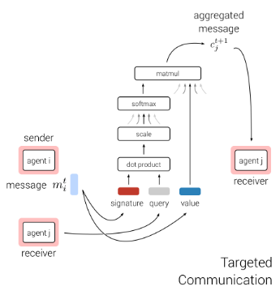
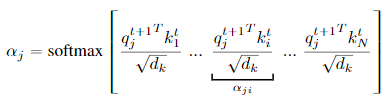

# MADRL-readings

## ** Multi-agent actor-critic for mixed cooperative-competitive environments. (Lowe et al., 2017)

---
## ** Counterfactual multi-agent policy gradients. (Foerster et al., 2018)

---
## Deep decentralized multi-task multi-agent rl under partial observability. (Omidshafiei et al., 2017)

---
## ** Cooperative multi-agent control using deep reinforcement learning. (Gupta et al., 2017)

---
## Fully decentralized multiagent reinforcement learning with networked agents. (Zhang et al. 2018) 

---

## Stabilising experience replay for deep multi-agent reinforcement learning. (Foerster et al. 2017)

---
## Mean field multi-agent reinforcement learning. (Yang et al., 2018).

---
## Learning to communicate with deep multi-agent reinforcement learning.(Foerster et al., 2016).

Goal: 
- learn a discrete communication signal among agents in a fully cooperative, partially observable settings.

Description:
- at each timestep t, each agent receives a local observation **ot** and discrete message signals from other agents **mt-1**
- then, it should take an environment action **ut** and a communication action **mt** 
- the communication action is sent to other agents via a communication channel. 

Method: 
- Reinforced Inter-Agent Learning (RIAL):  
  - agents use two deep Q networks **Qau(oat, ma't-1, hat-1, ua)** and **Qm(.)** to predict Q-values for environment and communication actions respectively, where:
    - **oat** is the agent's local observation, 
    - **ma't-1** are messages from other agents,
    - **hat-1** is the agent's hidden state (RNN to overcome partial observability)
  - the Q values are then passed to an action selector unit to pick **uat** and **mat** (using an ε-greedy policy).
  - it's end-to-end trainable within an agent (no gradients are passed between agents)
  - gradient chains are based on the DQN loss

- Differentiable Inter-Agent Learning (DIAL):
  - communication actions are replaced with direction connections from the output of one agent's network to the input of another
  - gradients can be pushed through the communication channel, yielding a system that is end-to-end trainable even across agents
  - gradient chains are based on both the DQN loss and the backpropagated error from the recipient of the message to the sender

They followed a centralized training decentralized execution paradigm. 

Centralized training is achieved via:
- parameter sharing (learning a single network) in RIAL.
- parameter sharing and pushing gradients across agents through the communication channel in DIAL.

---

## Learning multiagent communication with backpropagation. (Sukhbaatar et al., 2016).

Goal:
- coordination between agents in fully cooperative, partially observable settings by learning suitable communication between them
- communication is learned rather than being pre-determined

Description: 
- learns a single controller **Φ** that maps agents' states **s = {s1, ..., sJ}** into their actions **a = {a1, ..., aJ}** where **J** is the number of agents
- **Φ** consists of individual modules **fi** where i refers to the communication step
- each module **f** takes two input vectors for each agent **j**: the hidden state **hij** and the communication **cij** and outputs a vector **hi+1j** using the following formula (works as a signle linear layer followed by a non-linearity)

- the hidden vectors **hi+1** from agents are then averaged according to the following formula to compute the communication for the next step **ci+1j**

- the hidden vectors **hi** are also used to generate a distribution over the space of actions at the output layer

- as an alternative to broadcasting to all other agents, a mask could be used to choose only a certain range of agents to communicate with 

[Implementation](https://github.com/0b01/CommNet/tree/b826f00e21c22f38bea288ca2ee8cc15e2dde1eb)

---

## * Multiagent bidirectionally-coordinated nets: Emergence of human-level coordination in learning to play starcraft combat games. (Peng et al., 2017)

---
## Revisiting the master-slave architecture in multi-agent deep reinforcement learning. (Kong et al., 2017),

---

## ** Learning attentional communication for multi-agent cooperation. (Jiang & Lu, 2018)

---
## ** Learning when to communicate at scale in multiagent cooperative and competitive tasks. (Singh et al., 2018)

Goal: 
- learn what to communicate and when to communicate (allows agents to block their communication using a gating mechanism)
- suitable for any scenario (semi-cooperative, competitve and cooperative settings)

Description:
- the method is called Individualized Controlled ContinuousCommunication Model (IC3Net) 
- it allows agents to communicate their internal state gated by a discrete action
- a controller is used where each agent is controlled by an individual LSTM (still share parameters)

- the hidden state **htj** is passed to a policy **π** to generate an environment action **atj**

- the hidden state **htj** is also passed to a simple network **fg(.)** with a soft-max layer for 2 actions (communicate or not)

- the LSTM receives the local observation **otj**, the hidden and cell states **htj** and **ctj** and the communication vector **ctj**, and use it to generate the new hidden and cell states **ht+1j** and **ct+1j**

- next, the new hidden states **ht+1j'** and the binary actions **gt+1j'** from all agents are used to compute a gated average hidden state and is then transformed into a communication tensor by **C** (linear transformation matrix)

- to allow both cooperative and competitive scenarios, each agent should maximize its individual reward instead of a single global reward. to do that, multiple networks wiht shared parameters are used where each one of them controls a single agent separately. Each network consists of multiple LSTMs, each one processes an observation of a single agent, but because the network controls a single agent, only one of the LSTMs needs to output an action.

Side notes:
- uses REINFORCE to train **π** and **fg(.)**
- uses individual rewards for each agent which helps with credit assignment issues
- amenable to dynamic number of agents

---

## TarMAC: Targeted Multi-Agent Communication (Das et al., 2020)

Goal: not only learn what to send, but also to whom to address (in cooperative partially-observable settings)

Description:
- allows agents to choose which agents to address messages to using a signature-based soft attention mechanism
- at each timestep, each agent receives a local observation vector **wti** and an aggregated message vector **cti** from all other agents, and update its hidden state **hti** accordingly 
- the agent uses its policy **πΘi(ati|hti)** to output a probability distribution over its actions, and to also output an outgoing message vector **mti**

- each message consists of a signature **kti** (encoding the properties of the recipient) and a value **vti**
- at the receiving side, each agent **j** predicts a query vector **qt+1j** from its hidden state **ht+1j** 

- the query vector **qt+1j** is multiplied by the received signature vector **kti** to compute the attention weights **αij** which is then multiplied by the received value vector **vti** to compute the input message **ct+1j** for the agent at **t+1**

- attention weights are high when both sender and receiver predict similar signature and query vectors respectively

Side notes: 
- centralized training and decentralized execution paradigm
- uses actor critic algorithm with a centralized critic learnt over the agents' joint action space
- policy parameters are shared across agents
- the applied targeting mechanism is implicit (encode properties of recipients without addressing them explicitly)
- supports multiple rounds of interactions at every timestep 
- can be extended into competitve settings by utilizing the hard gating action from IC3Net to decide whether communication is needed or not (IC3Net + TarMAC models can learn both when to communicate and whom to address messages to)

---

## ** VAIN: Attentional Multi-agent Predictive Modeling (Yedid 2017)

