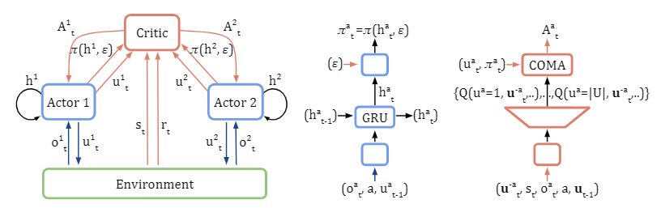

# ** Cooperative multi-agent control using deep reinforcement learning. (Gupta et al., 2017)

They focus on problems that can be modeled as Dec-POMDPs

They extend three classes of single-agent deep reinforcement learning algorithms:
- temporal-difference learning using Deep Q Networks (DQN)
- policy gradient using Trust Region Policy Optimization (TRPO)
- actor-critic using Deep Deterministic Policy Gradients (DDPG) 
- actor-critic using Asynchronous Advantage Actor Critic (AC3) 

They consider three training schemes 
- centralized training and execution
  - maps the joint observation of all agents to a joint action
  - issues: exponential growth in the observation and actions spaces with the number of agents 
  - to address the exponential growht action space, they factor the joint action into individual components for each agent, which reduces the size of the action space from |A|n to n|A| in the discrete case

- concurrent training with decentralized execution
  - each agent learns its own individual policy
  -  map an agent’s private observation to an action for that agent
  -  issues: non-stationary, which can lead to instability + adds additional sample complexity to the problem because agents don't share experience 

- parameter sharing during training with decentralized execution
  - allows the policy to be trained with the experiences of all agents simultaneously
  - control is decentralized but the learning is not

Results:
- policies trained with parameter sharing and an appropriate choice of reward function exhibit cooperative behavior without explicit communication between agents
- PS-TRPO policies have substantially better performance than PS-DDPG and PS-A3C in continuous action space
- PS-A3C is able to outperform PS-TRPO in the discrete domain
- curriculum learning is vital to scaling reinforcement learning algorithms in complex multi-agent domains (gradually increasing the number of agentsthat need to cooperate)

---

# Counterfactual multi-agent policy gradients. (Foerster et al., 2018) - COMA

COMA 
- centralisation of the critic
  - the critic is only used during learning, while only the actor is needed during execution
  - the critic conditions on the true global state s, if available, or the joint action-observation histories, while each agent’s policy/actor conditions only on each agent's own action-observation history

- use of a counterfactual base-line
  - naive approach: follow a gradient based on the TD error estimated from this critic (gradient for a particular agent does not explicitly reason about how that particular agent’s ac-tions contribute to that global reward)

  - instead, it uses a counterfactual baseline (inspired by difference rewards which compares the global reward to the reward received when that agent’s action is replaced with a default action)
  - the centralised critic can be used to implement difference rewards (without any further simulations or complications)
  - For each agent a, we can compute an agent-specific advantage function that compares the Q-value for the current joint action u to a counterfactual baseline that marginalises out a single agent’s action ua, while keeping the other agents’ actions u-a fixed

  
  - thus, it computes a separate baseline for each agent that relies on the centralised critic to reason about counterfactuals in which only that agent’s action changes

- use of a critic representation that allows efficient evaluation of the baseline
  - the actions of the other agents, ut−a, are part of the input to the critic network, which then outputs a Q-value for each of agent a’s actions. In other words, the critic computes in a single forward the Q-values for all the different actions of a given agent, conditioned on the actions of all the other agents
  - counterfactual advantage can be calculated efficiently by a single forward pass of the actor and critic for each agent

They also introduced 2 variatns of independent actor-critic (IAC)
- each agent learn independently, with its own actor and critic conditions only on its own action-observation history
- speed learning by sharing parameters among the agents
- the critic in the 1st variant estimates V while it estimates Q in the 2nd variant

COMA can significantly improve performance over other multi-agent actor-critic methods

COMA’s best agents are competitive with state-of-the-art centralised controllers that are given access to full state information and macro-actions

---
# *** Multi-agent actor-critic for mixed cooperative-competitive environments. (Lowe et al., 2017)

adopt the framework of centralized training with decentralized execution

a general-purpose multi-agent learning algorithm, which can be applied not only to cooperative interaction but to competitive or mixed interaction involving both physical and communicative behavior

a simple extension of actor-critic policy gradient methods where the critic is augmented with extra information about the policies of other agents, while the actor only has access to local information. 

only the local actors are used at execution phase, acting in a decentralized manner

The gradient of the expected return for agent i can be written as 

where Qπi(x,a1,...,aN) is a centralized action-value function. in the simplest case, x consists of the observations of all agents, but it could also include additional state information

the centralized action-value function Qπi is updated using

To remove the assumption of knowing other agents’ policies, each agent can maintain an approximation to the true policy of each other agent and use them in their own policy learning procedure. 

One downside is that the input space of Q grows linearly with the number of agents N. This could be remedied by, for example, having a modular Q function that only considers agents in a certain neighborhood of agiven a gent

vs COMA:
- learn a centralized critic for each agent (allowing differing reward functions) whereas COMA learns a single centralized critic for all agents 
- learn continuous policies whereas COMA learns discrete policies 

--- 

# Actor-Attention-Critic for Multi-Agent Reinforcement Learning (Iqbal et al., 2019)

an actor-critic algorithm that trains decentralized policies in multi-agent settings, using centrally computed critics that share an attention mechanism which selects relevant information for each agent at every timestep.

The main idea is to learn a centralized critic with an attention mechanism. The attention critic is able to dynamically select which agents to attend to at each time point during training, which improves performance in multi-agent domains with complex interactions.

The attention mechanism functions in a manner similar to a differentiable key-value memory model. Each agent queries the other agents for information about their observationsand actions and incorporates that information into the esti-mate of its value function. 

Qψi(o,a)is a function of agent i’s observation and action, as well as other agents’ contributions x

The contribution from other agents, xi, is a weighted sum of each agent’s value, where the value, vj is a function of agent j’s embeddings:

where V is a shared linear transformation matrix and h is a non-linear activation function

The attention weight αj compares the embedding ej with ei = gi(oi, ai) and passes the similarity value between these two embeddings into a softmax

where Wq transforms ei into a “query” and Wk transforms ej into a “key”.

It uses multiple attention heads, where each head can focus on a different weighted mixture of agents

their algorithm is very flexible:
- with any reward setup (applicable to cooperative, competitive, and mixed environment)
- different action spaces for each agent
- variance-reducing baseline that only marginalizes the relevant agent’s actions

The input space increase linearly with respect to the number of agents, as opposed tothe quadratic increase in a previous approaches

---
<!-- ## Stabilising experience replay for deep multi-agent reinforcement learning. (Foerster et al. 2017) -->
