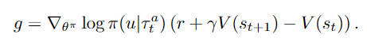

# MADRL-readings

---
## ** Counterfactual multi-agent policy gradients. (Foerster et al., 2018) - COMA

COMA 
- centralisation of the critic
  - the critic is only used during learning, while only the actor is needed during execution
  - the critic conditions on the true global state s, if available, or the joint action-observation histories, while each agent’s policy/actor conditions only on each agent's own action-observation history

- use of a counterfactual base-line
  - naive: follow a gradient based on the TD error estimated from this critic (gradient for a particular agent does not explicitly reason about how that particular agent’s ac-tions contribute to that global reward)

  - uses the centralised critic to compute an agent-specific advantage function that compares the estimated return for the current joint action to a counterfactual baseline that marginalises out a single agent’s action, while keeping the other agents’ actions fixed
  - computes a separate baseline for each agent that relies on the centralised critic to reason about counter-factuals in which only that agent’s action changes
  - inspired by difference rewards (comparing the global reward to the reward received when that agent’s action is replaced with a default action)

- use of a critic representation that allows efficient evaluation of the baseline

They also introduced 2 variatns of independent actor-critic (IAC)
- each agent learn independently, with its own actor and critic conditions only on its own action-observation history
- speed learning by sharing parameters among the agents
- the critic in the 1st variant estimates V while it estimates Q in the 2nd variant

---
## ** Cooperative multi-agent control using deep reinforcement learning. (Gupta et al., 2017)
---
## *** Multi-agent actor-critic for mixed cooperative-competitive environments. (Lowe et al., 2017)
---
<!-- ## Stabilising experience replay for deep multi-agent reinforcement learning. (Foerster et al. 2017) -->
