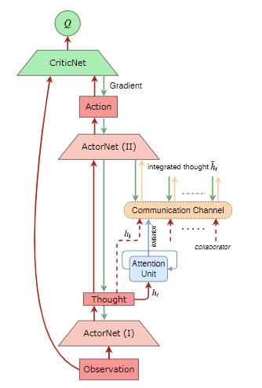
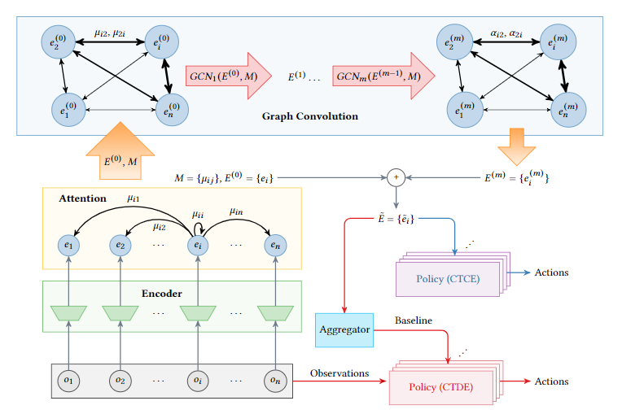
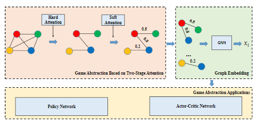
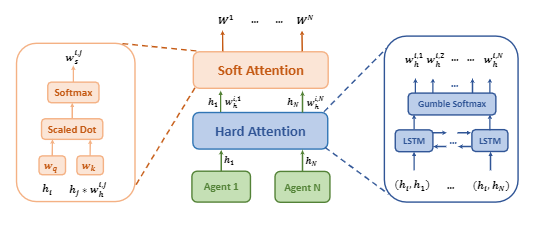
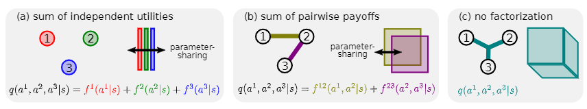

## Two layer Approach

- top layer will learn when it is necessary to observe the state information about other agents 
- bottom layer contains a single agent learning technique and a multi-agent technique

#### Sparse Tabular Multiagent Q-learning (Kok & Vlassis 2004)

- list of states at its disposal in which coordination is necessary
- by specifying the coordinated states beforehand, the agents only have to learn to coordinate their actions in these specific situations

#### Learning of Coordination (Melo & Veloso 2009)

- each robot focuses on learning its own optimal policy and com-pletely disregards the existence of the other robot. 
- each agent must learn from experience those situations in which coordination is beneficial.
- augment the action space of each agent with a coordination action COORDINATE that attempts to use information from the other agents (gathered by means of active perception: onboard camera or explicit communication) to decide the correct action

#### Learning multi-agent state space representations (De Hauwere 2010)
#### Solving Delayed Coordination Problems in MAS (De Hauwere 2011)

- use statistical tests to determine when to augment state-action space
- learn the absolute set of states in which the agents are interacting by detecting statistically significant changes in the reward signal

#### Learning attentional communication for multi-agent cooperation. (Jiang & Lu, 2018)
 
- enables dynamic communication among agents only when necessary
 
 
 
---

## Coordination graphs Approach

coordination graphs take advantage of an additive decomposition of the joint reward function to allow the agents to act independently, whenever that does not imply a loss of optimality

#### Sparse cooperative Q-learning (Kok and Vlassis 2004)

- assume coordination graphs (CG) is given
- uses CG in discrete state and action spaces by representing all utility and payoff functions as tables

#### Utile Coordination (Kok et al. 2005)

- instead of having to define the CGs beforehand, they are being learned online by maintaining statistical information about the obtained rewards conditioned on the states and actions of the other agents
- start with independent learners and maintain statistics on expected returns based on the action(s) of the other agents
- coordination dependencies are dynamically added if the statistics indicate a  statistically significant benefit
- a variable elimination algorithm is applied in which each agent first solves a local maximization problem, and then communicates the resulting conditional strategy to one of its neighbors

#### Deep Implicit Coordination Graphs for Multi-agent Reinforcement Learning. (Li et al., 2021) - DICG
 
 

#### Multi-Agent Game Abstraction via Graph Attention Neural Network (Liu et al. 2020) - G2ANet

 

#### Deep Coordination Graphs (Bohmer et al., 2019) - DCG  

