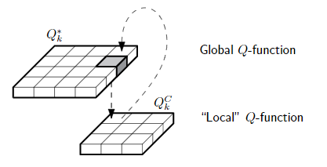
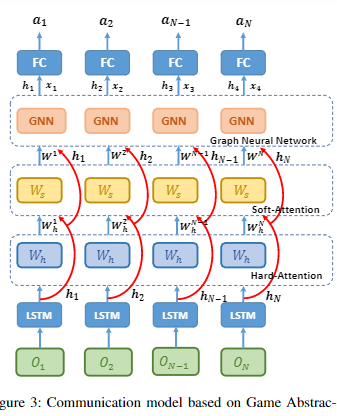
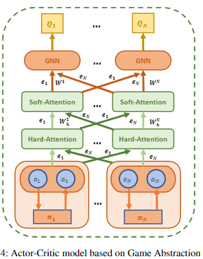
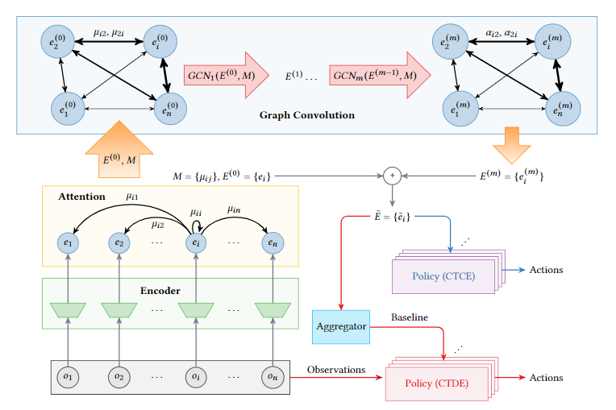

<!---
Fully centralized control (reduce the problem to a single agent problem where the action space is the joint action space of all agents) is often infeasible in such domains due to the size of joint action spaces since it grows exponentially with the number of agents

a common strategy is to decentralizeor factorize the deci-sion policy or value function for each agent [8,36,38]

Each agentselects actions to maximize its corresponding utility function, withthe end goal of maximizing the joint value function. 

suchdecentralization can be suboptimal due to relative overgeneralization (the agent’s reward gets confounded by penalties from random exploratory actions of other collaborating agents)

coordination graph(CG) reason about joint value estimates from a factored representation and allows explicit modeling of the locality of interactions

Coordination graph often require domain expertise in their design and can be difficult for dynamic environments with changing coordination requirements
-->

# Multiagent planning with factored MDPs (Guestrinet al. 2002)

use this CG to induce a factorization of an action-valuefunction intoutility functions andpayoff functions

draw on the connectionswith maximum a posteriori (MAP) estimation techniques in prob-abilistic inference to compute the joint action from such factor-izations; resulting into algorithms like Variable Elimination andMax-Plus

--- 
# Sparse Tabular Multiagent Q-learning (Kok & Vlassis 2004)

---

# Sparse cooperative Q-learning (Kok and Vlassis 2004)

- coordination graphs take advantage of an additive decomposition of the joint reward function to allow the agents to act independently, whenever that does not imply a loss of optimality
- they explore the use of coordination graphs

--- 

# Utile Coordination (Kok et al. 2005)

- try to learn coordination graphs from the interactions of the agents.

---

# Learning of Coordination (Melo & Veloso 2009)

in many applications the interactions between the different agents coexisting in a common environment are not very frequent. Our approach seeks to exploit local interactions, allowing the agents to act independently whenever possible. Each robot focuses on learning its own optimal policy and com-pletely disregards the existence of the other robot. However, it may happen that, in some situations, the rewards of one robot do depend on the state/actions of the other robot. So, each agent must learn from experience those situations in which coordination is beneficial.

we develop an algorithm in which independent decision-makers/agents learn both individual policies and **when** and **how** to coordinate. It's basically a two-layer extension of Q-learning, in which we augment the action space of each agent with a coordination action that attempts to use information from the other agents (gathered by means of active perception) to decide the correct action

The reward of an agent k could be decomposed into 
  - an individual component that depends only on the local state and action of agent k (individual goal)
  - a common component rC that depends on the overall state of the game and on the actions of all agents

  - if rC = 0, each agent can use standard Q-learning to learn its optimal individual policy πk*
  - if rC(x, a) != 0 in some state x, the policy learned by each agent will be sub optimal since the optimal one must take into account state/action information about the other agent

we augment the individual action-space of each agent with one “pseudo-action” (COORDINATE) that consists of two steps:
- an active perception step 
  - the agent tries to determine the local state information of the other agent. 
  - by using for example a onboard camera to localize the other robot or by explicit communication where one robot requires the other robot to divulge its location)
  - whether or not this step actually succeeds is environment-dependent
- a coordination step 
  - the agent makes use of the local state information from the other agent to choose one of its primitive actions
  - each agent k keeps a second Q-function QCk defined in terms of Qk* 

  - the update of QCk uses the estimates of Qk* because the individual action at the next step will depend on the values in Qk* and not on QCk (there is not a “direct” dependency among entries in QCk)
  - the values in QCk only determine the one-step behavior of the COORDINATE action

Since the penalty of miscoordination is bigger than the cost of using the active perception, the agents learn to take this action in the interaction states

Notes: 
- How does our works differ from previous methods that explore locality of interaction?
  - previous methods rely heavily on assumptions of joint-state and joint-action observability, even if only at a local level. We instead do not assume joint-action observability, but explore joint-state observability whenever possible
  - agents in our setting **do not share the same reward function** (unlike Dec-MDPs or Dec-POMDPs)
  - the situations in which the agents should interact/coordinate are assumed predefined
- In MGs with N > 2 agents, each agent can only perceive the local state information concerning one other agent
- the COORDINATE action does not use any joint action information, only joint state information.
- the outcome of this algorithm is strongly dependent on the value of this penalty

<!-- 
Exploiting Factored Representations for Decentralized Execution in Multi-agent Teams
-->

---

# Learning multi-agent state space representations (De Hauwere 2010)

---

# Relational deep reinforcement learning. (2018) ...

embeds multi-head dot-product at-tention as relational block into graph neural networks to learnpairwise interaction representation of a set of entities in the agent’sstate

---

# Learning attentional communication for multi-agent cooperation (Jiang and Lu 2018) - ATOC ===>

use self-attention **to learn when to communicate with neigh-boring agents**

---

# Factorized  q-learning  for  large-scale  multi-agent  systems (Chen et al., 2018)

---

# Mean field multi-agent reinforcement learning (Yang et al., 2018)

---

# Attentional Policies for Cross Context Multi-Agent Reinforcement Learning (2019) ....

use atten-tion mechanism in their actor to aggregate information from otheragents sharing some similarities with DICG-CE

do not use attention to create a coordination graph structure that can be usedby a graph neural network to process the observation embeddings

---

# Actor-Attention-Critic for Multi-Agent Reinforcement Learning (Iqbal et al., 2019) ===>

use attention mechanism in their critic to dynamicallyattend to other agents

they do not use the concept of a coordination graph and process those embeddings with a graph neural network

---

# The representational capacity of action-value networksfor multi-agent reinforcement learning (Castellini et al., 2019) ...

approximate payoff functions in the simplified case of non-sequential one-shot games

learn aseparate network for each function fi and fij

---

# Multi-Agent Game Abstraction via Graph Attention Neural Network (Liu et al. 2020) - G2ANet

Because the interactions between agents often happen locally, agents neither need to coordinate with all other agents nor need to coordinate with others all the time. transforming these complex interactions between agents into pre-defined rules is difficult in large-scale environments, and cannot dynamically adjust based on the state  transition

Alternatively, we propose to automatically learn the interaction relationship between agents through end-to-end model design. we model the relationship between agents by a complete graph and propose a multi-agent game abstraction algorithm based on two-stage attention network (G2ANet), where hard-attention (non-differentiable) is used to cut the unrelated edges and soft-attention (differentiable) is used to learn the importance weight of the edges. We integrate this algorithm into GNN for conducting game abstraction and obtaining the contribution from other agents. we propose two novel learning algorithms 
- GA-Comm (with a policy network / communication-based) 
- GA-AC (with a Q-value network / actor-critic based)

 

- each agent i receives a local observation ot at each time-step t
- encode the local observation oti into a feature vector hti by an MLP
- use the hard-attention mechanism to learn the hard weights Whi,j which determines whether there is an edge/interaction between agent i and j 
  - merge embedding vector of agent i,j into a feature (hi,hj)  
  - input the merged feature into a BiLSTM model (Bi to make sure the order of the inputs doesn't play an important role in the process!)
  - use a gumbel-softmax to achieve back-propagation 
- use a soft-attention (query-key system) to learn the weight of each edge in Gi
  - transform ej into a key using Wk
  - transform ei into a query using Wq
  - compare the embedding ej with ei and using a query-key system
  - pass the matching value between these two embeddings into a softmax to compute the attention weights Ws_ij 
- you get a reduced graph in which each agent is connected only to the agents that need to interact with
- use Graph Neural Network (GNN) to obtain a vector (joint encoding) representing the contribution of all other agents for the agent i

2 variants

- Policy network in communication model (GA-Comm)
  - combine G2ANet with policy network
  - each agent considers the communication vectors of all other agents when making decision
  - agent i receives its observation oi 
  - uses a LSTM layer to extract the feature 

  - use the two-stage attention mechanism to calculate the contribution xi for agent i from other agents (weighted sum) 
 
  - compute the action ai for agent i using action policy π 

- Critic network in actor-critic model (GA-AC)
  - combine G2ANet with Q-value network
  - critic network of each agent considers the state and action information of all other agents when calculating its Q-value
  - the critic network receives the observations o= (o1,...,oN) and actions, a= (a1,...,aN) for all agents
  - compares the embedding ej with ei=gi(oi,ai) and passes the relation value between these two embeddings into a softmax function 

  - compute the embedding of agent j, vj, and use a a weighted sum of each agents value (as a simple method to implement GNN)

  - the value function for agent i is computed using  where fi and gi are multi-layer perception (MLP), and xi is the contribution from other agents

Notes
- when soft-attention mechanism is used to learn the importance distribution of the other agents, the importance weight of each agent still depends on the weight of the other agent. thus, this mechanism cannot directly reduce the number of agents that need to interact since the unrelated agents will also obtain an importance weight

<!--
loosely  coupled  multi-agent  systems

Guestrin, Lagoudakis, and Parr 2002; Coordinated reinforcement learning
Kok  and  Vlassis  2004; Sparse cooperative Q-learning
De  Hauwere,  Vrancx,  and  Now ́e2010; Learning multi-agent states pace representations
Melo  and  Veloso  2011; De-centralized MDPs with sparse interactions
Hu,  Gao,  and  An  2015; Learning in multi-agent systems with sparse interactions by knowledge transfer and game abstraction
Yu et al. 2015; Multiagent  learning  of  coordination  in  loosely  coupled multiagent  systems
Liu et al. 2019; Value function transfer for deep multi-agent reinforce-ment learning based on n-step returns

achieving game abstraction through pre-definedrules

Yang et al. 2018; Mean field multi-agent reinforcement learning
Jiang,  Dun,  and  Lu  2018; Graph convolutional reinforcement learning for multi-agent cooperation

uses soft-attention mechanismto learn the importance distribution of the other agents

Jiang and Lu 2018; Learning attentional communication for multi-agent cooperation. 
Iqbal and Sha 2018; Actor-attention-critic for multi-agent reinforcement learning.

-->

---

# Graph Convolutional Reinforcement Learning (Jiang et al. 2020)

use multi-head dot product attention **to compute interactions between neighbouring agents for the purposeof enlarging agents’ receptive fields** and extracting latent features ofobservations

use attention mechanism to obtain a relational kernel for use in a graph neural network

focused on value based methods and use Deep Q-learning

do not usethe attention weights to create a coordination graph

they hand craft the adjacency matrix used by the graph neural network

---

# Deep Coordination Graphs (Bohmer et al., 2019) - DCG  

*re-read Related Work*

*DCG factors the joint value function of all agents, according to a **given** static coordination graph, into payoffs between pairs of agents. The value can be maximized by local message passing along the graph, which allows training of the value function  end-to-end with deep Q-learning*

MARL often addresses the issue of large joint observation and action spaces by assuming that the learned policy is fully decentralized. This corresponds to factoring the joint value function into utility functions where each depends only on the actions of one agent. In this case, the joint value function is easily maximized if each agent selects the action that maximizes its utility function. However, decentralized policies behave sub-optimally in tasks where the optimal policy would condition on multip leagents’ observations in order to achieve the best return. 

A higher-order value factorization can be expressed as an undirected coordination graph where each vertex represents one agent and each (hyper-) edge represents one payoff function over the joint action space of the connected agents. This can represent a richer class of policies. However, the value can no longer be maximized by each agent individually. Instead, message passing along the edges (belief propagation or max-plus) is needed.

DCG represents the value function as a CG with pair-wise payoffs and individual utilities which improves the representational capacity beyond value factorization approaches like VDN and QMIX

- A CG induces a factorization of the Q-function into utility functions fi and payoff functions fij (each additional edge enables the value representation of the joint actions of a pair of agents): 

- at time t, each node i sends messages μijt(aj) over all adjacent edges {i,j} ∈ E.
- messages can be computed locally as 

- after a number of iterations of this process, each agent i can locally find the action ai* that maximizes the estimated joint Q-value

DCG incorporates the main following design principles:
- restricting the payoff's input to local information of agents i and j only: 
fiθ(ui|τit) ≈ fvθ(ui|hit) and fijφ(ai,aj|τit,τjt) ≈ feφ(ai,aj|hit,hjt) -> improve sample efficiency
- sharing parameters between all payoff and utility functions through a common RNN hit := hψ(·|hit-1,oit,ait-1) -> improve sample efficiency
- a low-rank approximation of joint-action payoff fij(.,.|τit,τjt) -> reduce the number of parameters

Notes:
- DCG scales CG for the first time to large state and action spaces
- The reliability of DCG depends on the CG-topology (fully connected DCG, CYCLE, LINE, STAR, VDN)
- the computational complexity of the graph topology scales quadratically (better than exponentially)
- DCG address *relative overgeneralization (when the optimal policy cannot be represented by utility functions alone)* for centralized or distributed controllers
- DCG prevent relative overgeneralization during the exploration of agents
- DCG employs parameter sharing between pay-offs and utilities
- dependencies on more agents can be modeled as hyper-edges in the DCG, but this hurts the sample efficiency

DCG extended these ideas of factoring the joint value function of all agents according to a static coordination graph into payoffs between pairsof agents to deep MARL by estimating the payoff functions using neural networks and using message passing based on Max-Plus along the coordination graph to maximize the valuefunction, allowing training of the value function end-to-end

---

# Deep Implicit Coordination Graphs for Multi-agent Reinforcement Learning. (Li et al., 2021) - DICG

<!-- re-read the introduction. it's very detailed -->

*key contribution is to take inspiration from the coordination graph literature and design a fully differentiable architecture*

DICG is a module for inferring the dynamic coordination graph structure

For several domains, the outcome of an agent’s action often depends only on a subset of other agents in the domain. The locality of interaction can be encoded in the form of a coordination graph which allow reasoning about the joint-action based on the structure of interactions

Instead of explicitly computing the joint action through inference over factored representation with a given coordination graph, we use attention to learn the appropriate agent observation-dependent coordination graph structure with soft edge weights and then we use message passing in a graph neural network to compute appropriate values or actions for the agents, such that full the computation graph remains differentiable

To avoid building coordination graphs using hard-coded or domain-specific heuristics, the DICG module uses self-attention **to learn the attention weights between agents, and use the attention weights to form a “soft”-edged coordination graph** instead of edges with binary weights. These soft edges form an implicit coordination graph representing elements of its adjacency matrix M. Using this adjacency matrix, graph convolution could be applied to integrate information across agents. The integrated information could be then used as observation embeddings to directly obtain actions or to estimate baselines for advantage estimation.

The DICG module consists of anencoder, an attention module, and a graph convolution module

  - pass n observations oi for the n agents through an encoder (parameterized by thetae) to output n embedding vectors ei each with size d

  - compute the attention weights from agent i to j using these embeddings as (attention module is parameterized by Wa (dxd))

  - use these attention weights to form an nxn adjacency matrix M with Mij = 𝜇ij
  - stack the embeddings to form an nxd feature matrix E with the ith row being the embedding eiT
  - using E and M, apply graph convolution to perform message passing and information integration across all agents (H(0) = E(0))

  - repeat the convolution operation m times to get the output H(m) or E(m)
  - use a residual connection between E(0) and E(m) to obtain the final embedding matrix E-tilda
  - based on the communication constraints, we have 2 approaches:
    - communication is allowed (CTCE/DICG-CE) -> pass the corresponding embedding ̃𝑒i to a (separate/parameter shared) policy network to obtain actions for each agent 
    - not allowed (CTDE/DICG-DE) -> pass E-tilda to an aggregator network (MLP) to estimate the centralized baseline and use it to compute the advantage function while training (separate/parameter shared) policy networks. Critic is not required during exection and agents can act independently

Notes:
  - DICG is not strictly the payoff-utility based coordination graph as is standard in the literature but builds off the same idea of reasoning about the joint action based on the relatively sparse interactions between the agents.
  - encoder and attention modules are parameter shared among agents
  - DICG solves the relative over generalization pathology
  - DICG allows learning the tradeoff between full centralization and decentralization
  - DICG can be used inside either the actor or the critic and can be trained end-to-end to optimize the joint reward

---
