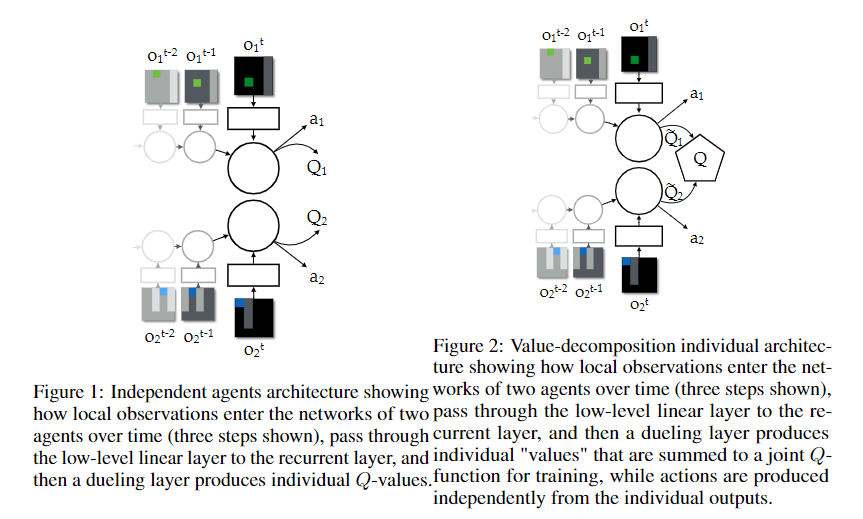
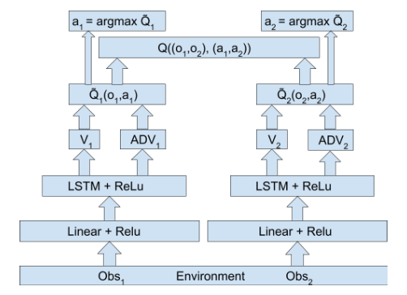
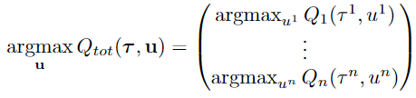

# MADRL-readings

## Value-Decomposition Networks For CooperativeMulti-Agent Learning (Sunehag et al., 2017)

a system of several learning agents must jointly optimize a single reward signal. The centralised approach fails by learning inefficient policies with only one agent active and the other being “lazy”. In contrast, independent Q-learners cannot distinguish teammates’ exploration from stochasticity in the environment

The value decomposition network aims to learn an optimal linear value decomposition from the team reward signal, by back-propagating the total Q-gradient through deep neural networks representing the individual component value functions

The main assumption is that the joint action-value function for the system can be additively decomposed into value functions across agents

By representing Q_tot as a sum of individual value functions Q_a that condition only on individual observations and actions, a decentralised policy arises simply from each agent selecting actions greedily with respect to its Q_a.

 although learning requires some centralization, the learned agents can be deployed independently, since each agent acting greedily with respect to its local value ̃Q

Agent’s learning algorithm is based on DQN (uses LSTM to overcome partial observability)

VDN can be nicely combined with weight sharing and information channels

They have experimented with different approaches including low-level communication channel, high-level communication channel, centralized, individual. They found that the architectures based on value-decomposition perform much better

Notes
- The implicit value function learned by each agent depends only on local observations, 
- Learns in a centralised fashion at training time, while agents can be deployed individually

---

## QMIX: Monotonic Value Function Factorisation for Deep Multi-Agent Reinforcement Learning (Rashidet al., 2018)

a value-based method that can train decentralised policies in a centralised end-to-end fash-ion

a network that estimates joint action-values as a complex non-linear combination of per-agent values that condition only on local observations

VDN severely limits the complexity of centralised action-value functions that can be represented and ignores any extra state information available during training. Alternatively, QMIX can represent a much richer class of action-value functions

The full factorisation of VDN is not necessary to extract decentralised policies that are fully consistent with their centralised counterpart. Instead, we only need to ensure that a global argmax performed on Qtot yields the same result as a set of individual argmax operations performed on each Q_a. (enforce the joint-action value is monotonic in the per-agent values) 

each agent can participate in a decentralised execution by choosing greedy actions with respect to its Qa

QMIX architecture consists of agent networks, a mixing network, and a set of hypernetworks

- for each agent, agent network that represents its individual value function Q_a (DRQNs)
- a mixing network that combines them into Q_tot in a complex non-linear way that ensures consistency (the weights of the mixing network are restricted to be non-negative to enforce the monotonicity constraint)
- a set of hypernetworks: each hypernetwork takes the states as input and generates the weights of one layer of the mixing network. it uses an absolute activation function, to ensure that the mixing network weights are non-negative

QMIX transforms the centralised state into the weights of another neural network. This second neural network is constrained to be monotonic with respect to its inputs by keeping its weights positive.

QMIX outperforms IQL and VDN, both in terms of absolute performance and learning speed
